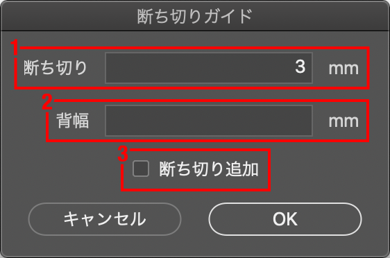
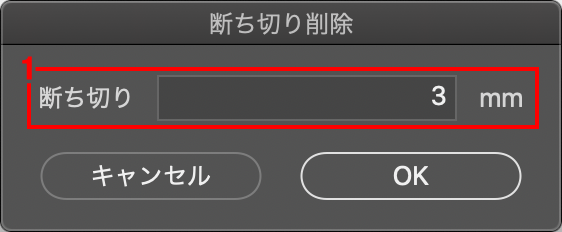
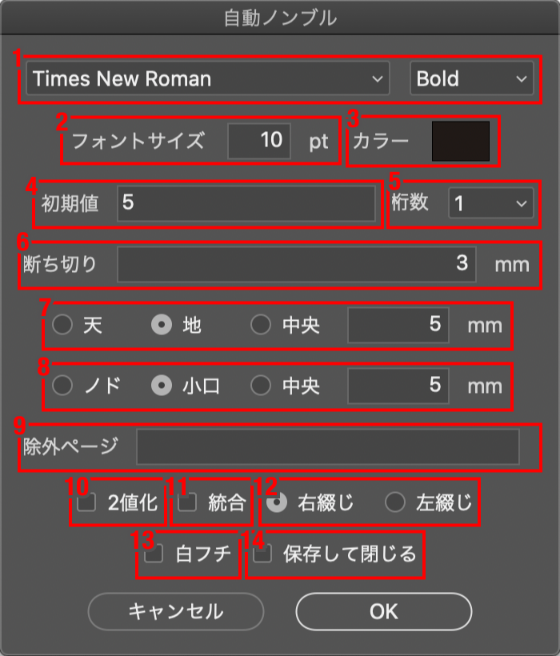
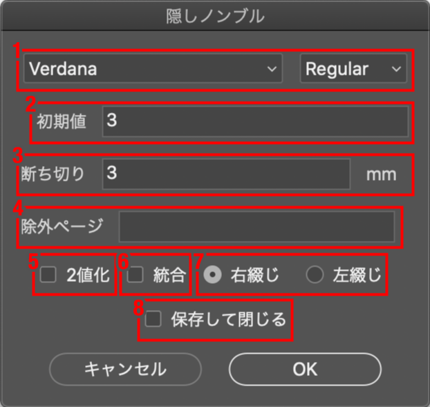
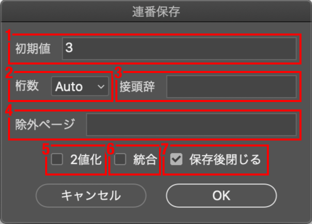

# Doujin Helper for Photoshop

The ExtendScripts for Photoshop that are useful for making doujinshi.

同人誌制作をサポートするPhotoshop用のスクリプトです。  
自分が同人誌を作る際に作成したものを、使いやすく改良しました。

**自動保存などで取り返しのつかないことになる可能性があります。**  
使用前に一度ダミーのファイルで試してみて、使用感を確かめてください。

## Installation

Copy the files under 'dist' into the Photoshop Scripts folder.

dist以下のファイルをPhotoshopのScriptsフォルダにコピーしてください。

- macOS : Applications/Adobe Photoshop xxxx/Presets/Scripts
- Windows : Program Files\Adobe\Adobe Photoshop xxxx\Presets\Scripts

## Usage

### 断ち切りガイド / Auto bleed.jsx

Add the bleed and spine guides.

断ち切りの位置にガイドを追加します。断ち切り分ドキュメントサイズを変更する機能と、表紙用に背幅のガイドを追加する機能もあります。

<dl>
	<dt>1. 断ち切り</dt>
	<dd>断ち切りのサイズをmmで指定します。</dd>
	<dt>2. 背幅</dt>
	<dd>背幅のサイズをmmで指定します。未入力ではなにもしません。0を入れると、中心に1本だけガイドを追加します。</dd>
	<dt>3. 断ち切り追加</dt>
	<dd>断ち切り分だけドキュメントサイズを拡大します。ガイドの追加前に処理されます。</dd>
</dl>

### 断ち切り削除 / Remove bleed.jsx

Reduces the document size by the bleed width.

断ち切り分だけドキュメントサイズを縮小します。  
サンプル画像を書き出すときなどに便利です。

また、負数を入れると拡大します。

<dl>
	<dt>断ち切り</dt>
	<dd>断ち切りのサイズをmmで指定します。</dd>
</dl>

### 自動ノンブル / Auto folio.jsx

Add folios (page numbers) automatically.

現在開いているすべてのドキュメントに、自動でノンブル（ページ番号）を追加します。  
**自動保存を選択した際、保存先のフォルダに同名のファイルがあると、問答無用で上書きするので注意してください。**

すべての処理が終わると、アラートが出ます。

<dl>
	<dt>1. フォント</dt>
	<dd>使用するフォントとスタイルを指定します。</dd>
	<dt>2. フォントサイズ</dt>
	<dd>フォントのサイズをptで指定します。</dd>
	<dt>3. カラー</dt>
	<dd>フォントカラーをカラーピッカーから選択できます。</dd>
	<dt>4. 初期値</dt>
	<dd>ノンブルの初期値です。この数値から開始します。</dd>
	<dt>5. 桁数</dt>
	<dd>ノンブルの最低桁数です。この桁数に満たない場合は自動的に0埋めします。</dd>
	<dt>6. 断ち切り</dt>
	<dd>断ち切りのサイズをmmで指定します。</dd>
	<dt>7. 垂直位置</dt>
	<dd>ノンブルの垂直方向の位置を指定します。天・地（本の上端・下端）のどちらを基準にするか選び、そこから何mm離れた位置にノンブルを打つかを指定します。中央を選んだ場合は位置の指定はありません。</dd>
	<dt>8. 水平位置</dt>
	<dd>ノンブルの水平方向の位置を指定します。使い方は垂直方向と同じです。基準はノド・小口（本の綴じている側・開く側）で、綴じ方向とページの偶数・奇数によって左右が異なります。</dd>
	<dt>9. 除外ページ</dt>
	<dd>スキップするページ番号をカンマか半角スペース区切りで指定します。ここで指定した数のノンブルは打たれません。</dd>
	<dt>10. 2値化</dt>
	<dd>カラーモードをモノクロ2階調に変換します。変換方法は「50%を基準に2階調に分ける」です。</dd>
	<dt>11. 統合</dt>
	<dd>すべてのレイヤーを統合します。2値化した場合も仕様上統合されます。</dd>
	<dt>12. 綴じ方向</dt>
	<dd>右綴じか左綴じかを選択します。右綴じの場合、奇数ページの小口は左側に、ノドは右側になります。左綴じはその逆です。</dd>
	<dt>13. 白フチ</dt>
	<dd>ノンブルに白い縁取りを付けます。</dd>
	<dt>14. 保存して閉じる</dt>
	<dd>ノンブルを打ったら自動的に別名保存してドキュメントを閉じます。これをチェックした場合、処理前に保存するフォルダの選択画面が出ます。</dd>
</dl>

### 隠しノンブル / Blind folio.jsx

Add blind folios automatically.

現在開いているすべてのドキュメントに、自動で隠しノンブル（綴じたときに見えなくなるページ番号）を追加します。  
**自動保存を選択した際、保存先のフォルダに同名のファイルがあると、問答無用で上書きするので注意してください。**

ノド（綴じ側）ギリギリのところに、6ptのノンブルを打ちます。2桁以上になる場合は改行して縦になります。
また、下がベタ塗りでも見えるように、自動的に白い縁取りが追加されます。

すべての処理が終わると、アラートが出ます。

<dl>
	<dt>1. フォント</dt>
	<dd>使用するフォントとスタイルを指定します。</dd>
	<dt>2. 初期値</dt>
	<dd>隠しノンブルの初期値です。この数値から開始します。</dd>
	<dt>3. 断ち切り</dt>
	<dd>断ち切りのサイズをmmで指定します。</dd>
	<dt>4. 除外ページ</dt>
	<dd>スキップするページ番号をカンマか半角スペース区切りで指定します。ここで指定した数の隠しノンブルは打たれません。</dd>
	<dt>5. 2値化</dt>
	<dd>カラーモードをモノクロ2階調に変換します。変換方法は「50%を基準に2階調に分ける」です。</dd>
	<dt>6. 統合</dt>
	<dd>すべてのレイヤーを統合します。2値化した場合も仕様上統合されます。</dd>
	<dt>7. 綴じ方向</dt>
	<dd>右綴じか左綴じかを選択します。</dd>
	<dt>8. 保存して閉じる</dt>
	<dd>隠しノンブルを打ったら自動的に別名保存してドキュメントを閉じます。これをチェックした場合、処理前に保存するフォルダの選択画面が出ます。</dd>
</dl>

### すべてのドキュメントを連番で保存 / Save as sequential number.jsx

Save open documents with sequential numbers.

現在開いているすべてのドキュメントを、開いている順番に連番のファイル名を付けて保存します。  
例：01.psd, 02.psd, ...  
**保存先のフォルダに同名のファイルがあると、問答無用で上書きするので注意してください。**

複数ページのPDFを開いて、一括でPSDで保存するといった使い方ができます。

すべての処理が終わると、アラートが出ます。

<dl>
	<dt>1. 初期値</dt>
	<dd>連番の初期値です。</dd>
	<dt>2. 桁数</dt>
	<dd>連番の最低桁数です。この桁数に満たない場合は自動的に0埋めします。Autoを選択すると、初期値と開いているドキュメントの数から桁数を自動判別します（最低2桁）。</dd>
	<dt>3. 接頭辞</dt>
	<dd>連番の前に付ける文字列。例えば「dojin」と入力すると、ファイル名は「dojin03.pdf」のようになります。システムで使用できない文字は取り除かれます。</dd>
	<dt>4. 除外ページ</dt>
	<dd>スキップする番号をカンマか半角スペース区切りで指定します。ここで指定した番号がファイル名に付けられることはありません。</dd>
	<dt>5. 2値化</dt>
	<dd>カラーモードをモノクロ2階調に変換します。変換方法は「50%を基準に2階調に分ける」です。</dd>
	<dt>6. 統合</dt>
	<dd>すべてのレイヤーを統合します。2値化した場合も仕様上統合されます。</dd>
	<dt>7. 保存後閉じる</dt>
	<dd>保存後にドキュメントを閉じます。</dd>
</dl>

## Default Settings

See 'DOUJINHELPER.conf'. It is vanilla JavaScript file.

各スクリプトの初期値は DOUJINHELPER.conf で設定できます。中身はJavaScriptの文法に従います。  
このファイル自体は無くても動きます。  

## Requirements

I have checked on environment below.

以下の環境で動作確認済みです。

- Photoshop 2022 / macOS Big Sur
- Photoshop 2022 / Windows 10

## License

[MIT](https://github.com/escapism/DoujinHelper/blob/master/LICENSE)